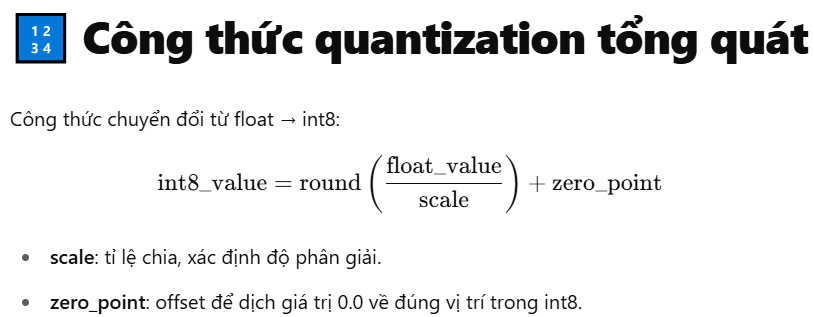

# Lý thuyết 
1. Tại sao cần Quantization ?
    - Mô hình AI khi inference thường chậm nếu chạy bằng PyTorch/TensorFlow do bao gồm thêm nhiều thành phần phục vụ cho training.
    - ONNX giúp loại bỏ những overhead không cần thiết, tập trung vào tốc độ infer.
    - Kết quả sau tối ưu:
        - Latency giảm 20-80% (tuỳ bài toán, phần cứng).
        - Kích thước model nhỏ hơn.
        - Khả năng triển khai dễ dàng hơn trên nhiều thiết bị.
2. Áp dụng ONNX cho sản phẩm/ứng dụng AI thực tế
    - Chuyển mô hình từ môi trường nghiên cứu sang production.
    - Triển khai API nhận diện ảnh, chatbot, hoặc inference server.
    - Giảm tải tài nguyên phần cứng khi scale hệ thống AI.
# Chi tiết
1. ONNX Graph Optimization
    - Thư viện: onnxruntime-tools
    - Chức năng:
        - Gộp các toán tử lại (fusion)
        - Cắt bớt các node dư thừa
        - Tái sắp xếp computation graph để tăng hiệu quả
2. Quantization
    - Quantization là kỹ thuật chuyển đổi các tham số (weights, activations) của mô hình từ kiểu số thực (floating point) có độ chính xác cao (thường là float32) sang kiểu số nguyên (integer) hoặc số thực có độ chính xác thấp hơn (như int8, float16)
    - Hầu hết các mô hình được huấn luyện bằng độ chính xác float32 (tức mỗi số thực có 32-bit: 1 bit dấu, 8 bit mũ, 23 bit mantissa). Điều này cho phép mô hình có độ chính xác cao, gradient ổn định trong training.
    - Tuy nhiên, khi inference:
        - Không còn backward
        - Không cần gradient 
        - Chịu sai số nhỏ    
    - Ta có thể giảm precision (tức số bit) xuống để:
        - Giảm kích thước mô hình
        - Tăng tốc độ inference do làm việc với số lượng bit ít hơn

| Precision      | Số bit | Giảm dung lượng so với float32 | Tốc độ infer |
| -------------- | ------ | ------------------------------ | ------------ |
| float32        | 32     | 1x                             | 1x           |
| float16 (FP16) | 16     | \~50%                          | 1.5x-2x      |
| int8 (INT8)    | 8      | \~75%                          | 2x-4x        |

- Cơ chế hoạt động:
    - Float16 (FP16): 
        - Không phải quantization hoàn toàn → chỉ giảm số bit phần mantissa/mũ.
        - Cắt 16 bit thập phân cuối cùng, giữ nguyên cấu trúc tensor
        - Dễ thực hiện hơn, ít làm giảm accuracy
        - ONNX hỗ trợ float16 conversion thông qua:
            - onnxruntime_tools.convert_float_to_float16
        - Dùng tốt trên GPU có Tensor Cores (NVIDIA Ampere trở lên).
    - int8: 
        - Là quá trình mapping giá trị thực sang integer 8-bit.
            - 
        -  Phải xác định:
            - Scale: tỉ lệ chuyển đổi giữa float và int8
            - Zero point: điểm neo offset
                - Khi chuyển từ float → int8, ta cần ánh xạ giá trị thực (liên tục) sang giá trị số nguyên (rời rạc).
                - Float có thể âm/dương.
                - Int8 chỉ có phạm vi từ -128 → 127 (hoặc từ 0 → 255 nếu unsigned).
                - là vị trí của giá trị 0.0 trong dải số nguyên sau khi ánh xạ.
        - Chứng minh:
            - 
            - 
            - 
            - 
            - 
3. Các loại quantization

| Loại                                  | Mô tả                                                                                      | Mức độ ảnh hưởng accuracy         |
| ------------------------------------- | ------------------------------------------------------------------------------------------ | --------------------------------- |
| **Post-training quantization (PTQ)**  | Quant hóa sau khi train xong, dùng thêm tập calibration nhỏ.                               | Ảnh hưởng nhỏ nếu calibration tốt |
| **Quantization-aware training (QAT)** | Trong quá trình train đã mô phỏng quantization → mô hình học cách chịu sai số ngay từ đầu. | Accuracy cao hơn                  |
| **Dynamic quantization**              | Chỉ quant weight; activation giữ nguyên, quant trong runtime                               | Đơn giản, dễ dùng                 |

4. Calibration
- Thống kê các giá trị float của mô hình thường nằm trong khoảng bao nhiêu để ánh xạ về int8 để giữ độ chính xác tốt nhất
- Nếu không có calibration:
    - dễ chọn sai range min/max => làm tăng sai số
- Calibration giúp chọn range hợp lý, giảm sai số khi quantization.
- Quy trình hoạt động :
    - Giả sử bạn có mô hình đã huấn luyện bằng float32:
        1. Chọn tập calibration data
            - Chỉ cần vài trăm đến vài ngàn mẫu (không cần dùng full train set).
        2. Chạy inference float32
            - Chạy mô hình trên calibration data.
            - Ghi lại min / max của mỗi tensor (activation, weight).
        3. Tính toán scale và zero-point
            - 
        4. Quant hóa mô hình
            - Dùng scale/zero_point vừa tính để map float → int8.   
- Các phương pháp Calibration :

| Phương pháp                    | Mô tả                                   | Độ chính xác                       |
| ------------------------------ | --------------------------------------- | ---------------------------------- |
| **Min-Max**                    | Dùng min/max đơn giản                   | Đơn giản, dễ sai số nếu có outlier |
| **Percentile (KL-divergence)** | Bỏ các outlier (ví dụ 99.99 percentile) | Chính xác hơn                      |
| **Entropy-based (KL)**         | Tối ưu phân phối giá trị                | Thường dùng nhất trong production  |

- Các loại element type trong file onnx:
    - 
    - 
   
5. Các vấn đề
    1. Fuse
        - hợp nhất toán tử, là quá trình gộp nhiều toán tử liên tiếp nhau trong graph thành một toán tử duy nhất tương đương về mặt toán học nhưng nhanh hơn, nhẹ hơn khi chạy inference.
        - Vì sao cần Fuse?
            -  Mỗi toán tử trong ONNX graph (Conv, MatMul, Relu, Add...) sẽ được thực thi bằng 1 kernel function bên dưới.
            - Mỗi lần engine (như ONNX Runtime, TensorRT, OpenVINO...) gọi thực thi 1 toán tử => phải gọi hàm kernel từ hệ thống backend (CPU, GPU, NPU)
            ```
            Kernel Call = 1 lần gọi thực thi toán tử sang phần cứng.
            ```
            - Càng nhiều kernel call => tăng latency, giảm hiệu suất do overhead call hàm
            - Trong quá trình training và export model, graph thường rất "nguyên bản" (nghĩa là rất nhiều node nhỏ kế tiếp nhau)
                ```
                Conv -> BatchNorm -> Relu -> Add -> Identity -> Cast -> Output
                ```
        - Conv + Relu, Conv + BN, MatMul + Add → là nhóm fuse "kinh điển" xuyên suốt mọi model.
        - Các node fuse phổ biến:

            | Pattern gốc               | Sau khi fuse                  |
            | ------------------------- | ----------------------------- |
            | `Conv → BatchNorm`        | `FusedConvBN`                 |
            | `Conv → Relu`             | `ConvRelu`                    |
            | `Conv → Add (bias)`       | `Conv (bias fused)`           |
            | `Conv → BatchNorm → Relu` | `FusedConvBNRelu`             |
            | `Conv → LeakyRelu`        | `ConvLeakyRelu`               |
            | `Conv → Add → Relu`       | `ConvAddRelu`                 |
            | `Conv → ResidualAdd`      | `ConvResidual` (ResNet style) |

        - Lý do hay fuse convolution:
            - Conv là toán tử nặng nhất → giảm kernel call.
            - BatchNorm có thể absorb vào Conv (bằng cách điều chỉnh weight & bias).
            - Activation dễ inline trong kernel.

        - Các node fuse phổ biến cho Transformer (NLP, GPT, BERT...):

            | Pattern gốc                         | Sau khi fuse               |
            | ----------------------------------- | -------------------------- |
            | `MatMul → Add (bias)`               | `Gemm`                     |
            | `MatMul + Add + Relu`               | `GemmRelu`                 |
            | `MatMul → Add → Softmax → MatMul`   | `AttentionFusion`          |
            | `Add → LayerNorm`                   | `SkipLayerNormFusion`      |
            | `LayerNorm → Dropout → ResidualAdd` | `LayerNormFusion`          |
            | `QKV Linear → Attention`            | `MultiHeadAttentionFusion` |
            | `Gelu → Erf`                        | `GeluFusion`               |

        -   Lý do hay fuse transformer:
            - Transformer có pattern attention rất lặp đi lặp lại.
            - LayerNorm cực kỳ phổ biến (GPT, BERT đều có).
            - Skip connection dễ absorb về SkipLayerNorm.
        
        - Các node fuse phổ biến cho RNN / Seq2Seq:

        | Pattern gốc    | Sau khi fuse |
        | -------------- | ------------ |
        | `LSTM Cell`    | `FusedLSTM`  |
        | `GRU Cell`     | `FusedGRU`   |
        | `MatMul → Add` | `Gemm`       |

        - Lý do hay fuse:
            - LSTM/GRU có pattern cố định, dễ build kernel fused.
        -  Các fuse nền tảng backend thường tự động hỗ trợ:

            | Backend          | Fusion hỗ trợ đặc biệt                                     |
            | ---------------- | ---------------------------------------------------------- |
            | **TensorRT**     | ConvBNRelu, AttentionFusion, MultiHeadAttention, LayerNorm |
            | **ONNX Runtime** | ConvBNFusion, GemmFusion, LayerNormFusion                  |
            | **OpenVINO**     | ConvFusion, Int8 AttentionFusion                           |
            | **CoreML**       | PackedConvFusion, Quantized AttentionFusion                |
            | **Qualcomm QNN** | ConvAddRelu, Quantized SkipLayerNorm                       |

        - 

    2. ONNX khi export mô hình từ framework (PyTorch, TensorFlow...) thường sinh ra graph chưa tối ưu:
        - Nhiều node dư thừa (Redundant nodes: Identity, Dropout, Cast...)
        - Các chuỗi ops lẽ ra có thể fused nhưng chưa được fuse
        - Subgraph chưa canonicalized
        - Không tận dụng kernel tối ưu nhất cho backend (CPU, GPU, NPU…)
        - => Sử dụng Netron để trực quan hóa graph:
            - Xem graph có bao nhiêu node tổng cộng?
            - Có các node dư thừa không?
                - Identity, Dropout (ko cần khi inference), Cast, Reshape , Transpose
            - Có fusion chưa? (vd: ConvRelu, GemmFusion...)
                - Fusion là trọng tâm để tăng tốc.
                - Có các op fused như : FusedConv, ConvRelu, GemmFusion, LayerNormFusion, AttentionFusion...
                - Nếu còn chuỗi ops rời rạc (Conv → Relu → Add) => cần fuse
            
    